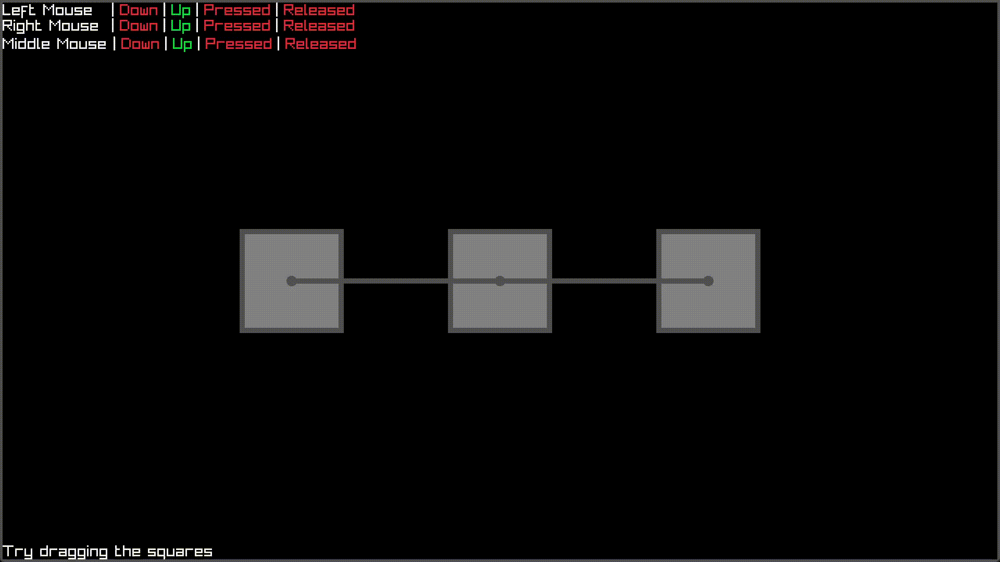

## Random raylib programs

### drag_drop
For some reason on Windows, `IsMouseButtonUp()` always returns true

### minesweeper
No flagging though, which is the best part in my opinion

### charge
This is probably inaccurate, but it looks cool so I don't care
